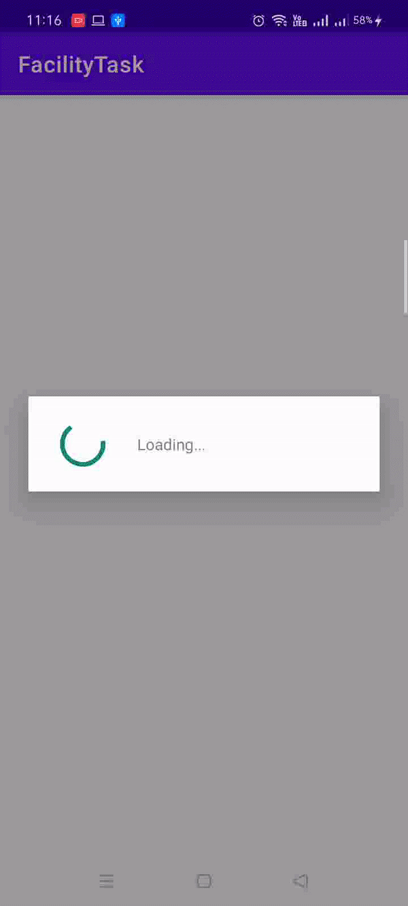

# Facility Task

## Project Overview

This is the Assignment-1 shared by Physics Wallah.

This app uses an API (https://my-json-server.typicode.com/ricky1550/pariksha/db) to  fetch the data from the server.

## What I learned

- Load data from the API server.

- Use adapters and custom list layouts to populate recycler views

- Incorporate libraries to simplify the amount of code you need to write

- Build a fully featured application that looks and feels natural on the latest Android operating system.

## Libraries

- [Android Architecture Components](https://developer.android.com/topic/libraries/architecture/)

* [ViewModel](https://developer.android.com/topic/libraries/architecture/viewmodel)

* [Retrofit](https://square.github.io/retrofit/)